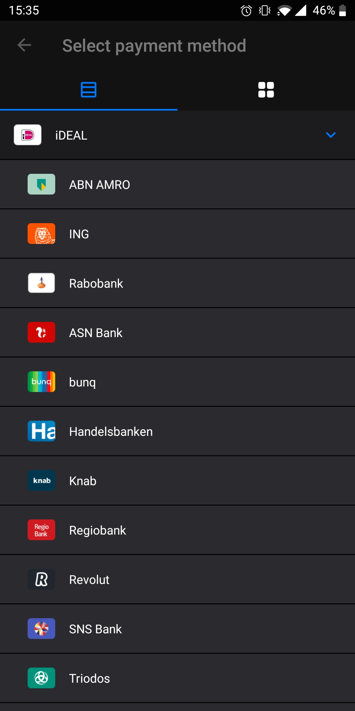

# About Mollie Checkout for Android

Mollie Checkout demonstrates how to handle Mollie payments in Android applications. We built this demo app to help you integrate with Mollie quicker.

This page provides you an overview of the different ways you can implement Mollie payments in your app. Before implementing one of the flows, read the following pages:

-   [Getting started](GETTING_STARTED.md)
-   [About the source](SOURCE.md)
    

## Functionalities

Mollie Checkout for Android focuses on the core functionalities needed to handle payments.

-   Retrieve payments
-   Create a payment
-   Select the issuer and payment method
-   Execute a payment
-   Handle an executed payment.

This demo app also enables you to configure settings for two different implementation flows, depending on your preference.

| Retrieve payments | Create payment | Select method and issuer |
| --------------- | ---------------- | ---------------------- |
|    |    |    |

## Flows

You can implement two different flows: basic and advanced. You can also customise the payment selection step (optional).

### Basic implementation

In the basic implementation flow, payment links open in an external browser on the customer’s device. A deep link returns the customer to the app after the payment is processed.

> ✅  **Tip**: We recommend this flow if you want to add Mollie payments to your app with minimum effort, because it’s easy to implement.

| Pros | Cons |
| --- | --- |
| <ul><li>The experience is similar to executing a Mollie payment on the web.</li><li>The payment flow is reliable, because it's handled natively by Mollie in the web.</li><li>You can do test payments because test and production payments are handled in a similar environment.</li></ul> | There are limited theming options because the flow uses an external browser. Some browsers support custom theming (such as _Chrome Custom Tabs_), however, customers might not have Chrome on their device. |

### Advanced implementation

In contrast to the [basic implementation](#basic-implementation), the advanced implementation opens payment links in a WebView. After the payment is processed, the customer returns to the app through a deep link, a callback, or by manually reopening the app.

The advanced implementation enables you to customise the payment flow in your app. You can style the components outside the WebView, such as the `Activity`, `Toolbar`, and so on.

However, it’s harder to implement than the basic implementation, because it requires more handling to ensure a smooth user experience. You also need to handle and test each case separately, which makes it more prone to errors.

| Pros | Cons |
| --- | --- |
| You can fully customise the payment flow in your app. | Requires more handling to test, for example: <ul><li>You must check whether other native apps are installed on the device, and launch the corresponding app when needed to execute a payment.</li><li>You must test using real payments, because production and test payments behave differently.</li></ul> |

### Customised payment method selection (optional)

When customers place an order in your app, the payment is executed in two steps:
1.  The customer selects the payment method, for example, iDEAL or credit card.
2.  The customer completes the payment using a native app or by providing requested details.

By default, Mollie handles both steps in the web. Mollie Checkout for Android enables you to add the payment method selection step to your app, so that you can customise it to match your app's theme.

If you include this step in your app, customers select the payment method in your app and complete the payment in the web.

| Pros | Cons |
| --- | --- |
| You can customise the payment method selection to match your app's theme. | <ul><li>Customers must select the payment method before creating the payment, which means they can’t go back to select a different method when they reach the completion step.</li><li>Requires additional configuration to implement a call that retrieves the payment methods to both the backend and the app.</li></ul> |

## Next steps

Read the following guides to implement Mollie payments in your app.

-   [Getting started](GETTING_STARTED.md)
-   [About the source](SOURCE.md)
-   [Implementing the basic flow](FLOW_BASIC.md)
-   [Implementing the advanced flow](FLOW_ADVANCED.md)
-   [Including payment method selection](IMPLEMENT_PAYMENT_METHODS.md)
